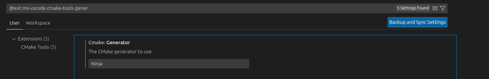

# Set-up build environment on Mac Os

For Mac os it is easier to use [Brew](https://brew.sh/) (community-based package manager). 

With Brew installed it is relatively easy as it requires one command to install all the required packages and libraries.

## Installing Brew

Follow the instructions on the [webpage](https://brew.sh/).

## Installation of packages and libraries

The command for installing the packages and libraries:

```bash
brew install cmake gcc opencv ninja
```

## Installing VSCode

Follow the instructions on the [VSCode website](https://code.visualstudio.com/docs/setup/mac).

## Compiling and running the example
The library contains an example demonstrating the usage and functionality of this library. 

To compile and run this example:

1. Clone this repo:
```
git clone https://github.com/CLFML/Face_Detector.Cpp.git
```

2. Open the cloned repo folder in vscode; `File->Open Folder`

3. Select Ninja as build generator by pressing **CRTL+SHIFT+P**->**"CMake: Open CMake Tools Extension Settings"**->**"@ext:ms-vscode.cmake-tools generator"**
   Now type Ninja (with capital N into the generator field!).
   

4. Select the `GCC kit`by pressing CTRL+SHIFT+p and selecting `CMake: Select a kit`.

5. CMake will now configure; By default it will configure as Debug build, this has a significant performance hit.
   To change to release with debug info (which has optimizations turned on, but is still debuggable). Press CTRL+SHIFT+p again and enter `CMake: Select Variant`-> `RelWithDebInfo`
   

6. Let CMake Finish configuring your build configuration. **Then click on the Play button on the blue bar on the bottom of screen**, CMake might ask which target to launch, select the `Face_roi_demo` target.
   
   
7. After build is finished, it will launch the demo which uses your camera to detect your face.