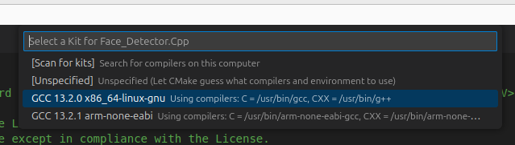
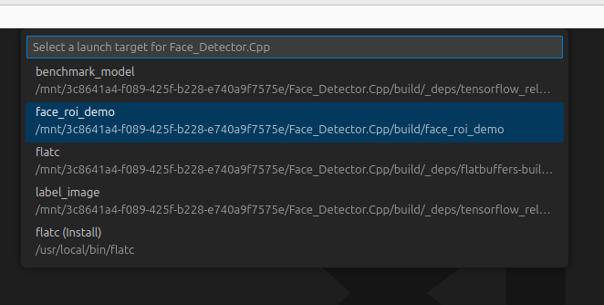

# Set-up build environment on Linux

Linux is one of the easiest os'es to set-up as most packages and libraries can be found in the package repositories.

## Ubuntu and Debian

```bash
sudo apt-get update && sudo apt-get install build-essential cmake ninja-build libopencv-dev
```

If you have not installed VSCode yet, do not install using APT in ubuntu as it will install the sandboxed snap version.

**Which has many issues due to the sandbox environment**

Use [this guide](https://code.visualstudio.com/docs/setup/linux) instead, which installs it using the APT repository from Microsoft themselves.


## Arch

```bash
sudo pacman -S opencv cmake gcc ninja
```

If you have not installed VSCode yet,

Install the `visual-studio-code-bin` package from AUR.


## Fedora

```bash
sudo dnf install opencv-devel gcc cmake ninja
```

If you have not installed VSCode yet, use [this guide](https://code.visualstudio.com/docs/setup/linux).


## Compiling and running the example
The library contains an example demonstrating the usage and functionality of this library. 

To compile and run this example:

1. Clone this repo:
```
git clone https://github.com/CLFML/Face_Detector.Cpp.git
```

2. Open the cloned repo folder in vscode; `File->Open Folder`

3. Select Ninja as build generator by pressing **CRTL+SHIFT+P**->**"CMake: Open CMake Tools Extension Settings"**->**"@ext:ms-vscode.cmake-tools generator"**
   Now type Ninja (with capital N into the generator field!).
   

4. Select the `GCC kit`by pressing CTRL+SHIFT+p and selecting `CMake: Select a kit`.
   
   
5. CMake will now configure; By default it will configure as Debug build, this has a significant performance hit.
   To change to release with debug info (which has optimizations turned on, but is still debuggable). Press CTRL+SHIFT+p again and enter `CMake: Select Variant`-> `RelWithDebInfo`
   
   
6. Let CMake Finish configuring your build configuration. **Then click on the Play button on the blue bar on the bottom of screen**, CMake might ask which target to launch, select the `Face_roi_demo` target.
   

7. After build is finished, it will launch the demo which uses your camera to detect your face.