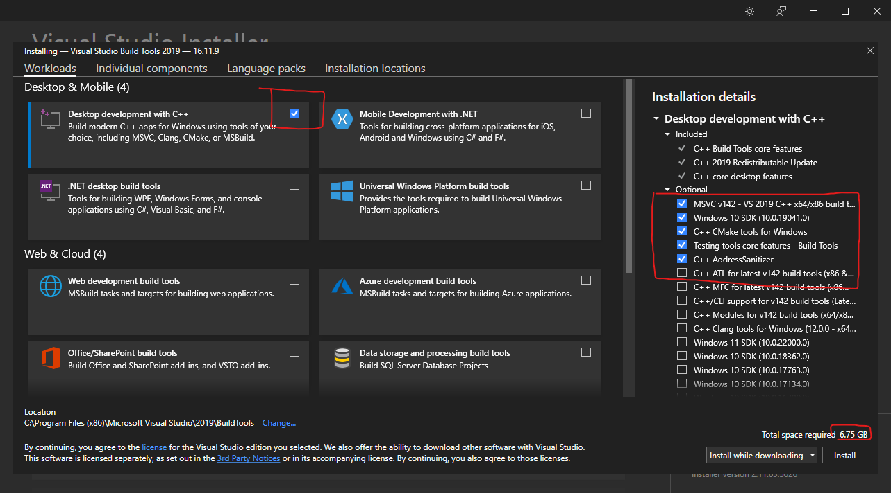

# Set-up build environment on Windows
Before you can compile and run the demo you need to install the following tools and libraries:

- OpenCV
- Any C/C++ compiler (MSVC is recommended, but GCC works as well)
- CMake
- Ninja (**Optional**, but recommended as generating for MSBuild is very slow!)
- Any code editor (This guide will use VSCode, as it is free and easy to configure with CMake)

!!! note

    Although any recent enough C/C++ compiler can be used. 
    
    **This guide will only use the MSVC compiler!**

    This choice was made as the precompiled versions of OpenCV are easier to configure with MSVC.

!!! warning
    Due to compatibility with OpenCV and other libraries, it is recommended to use MSVC16 (Visual studio 2019 edition). 

    As the newest MSVC(19, Visual studio 2022) is still not supported by the precompiled libraries of OpenCV (and many other libraries).

## Installing MSVC16 (2019 edition) & CMake
The MSVC compiler (and CMake) can be installed by either installing VS BuildTools or Visual Studio 2019.

**This guide will use the VS BuildTools method, as we don't need the Visual Studio IDE**.

There are multiple ways you can download and install VS BuildTools 2019;

- Manually downloading and installing using this [link](https://aka.ms/vs/16/release/vs_buildtools.exe)
- Using chocolatey:
  ```choco install visualstudio2019buildtools```
- Using winget:
```winget install --id=Microsoft.VisualStudio.2019.BuildTools  -e```

### Manually installing VS Build Tools 2019
1. [Download and run this installer](https://aka.ms/vs/16/release/vs_buildtools.exe).
2. Select these options:

3. After installation, reboot your machine!


## Installing Ninja
1. [Download the latest Ninja release for Windows!](https://github.com/ninja-build/ninja/releases)
2. Unzip this ninja-win.zip to `C:\ninja-win`
3. Open the environment variables editor using the Windows Startup Menu ([Try this guide if you can't find it](https://www.imatest.com/docs/editing-system-environment-variables/#Windows))
4. Add the `C:\ninja-win` path to the PATH variable;
5. Open a commandline window and check if Ninja is correctly installed by running the `ninja` command!

## Installing OpenCV
OpenCV offers precompiled libraries for usage with the MSVC compiler on Windows. To install these libraries;

!!! warning
    **It is recommended to leave the installation path to the default setting;**

    This path needs to be added to environment variables and your PATH variable! 
    
    If you still want to pursue with a custom installation path,
    
    Change the default; "C:\OpenCV" path in **STEP 3 & 4** to your custom installation path!

1. [Download and install the latest OpenCV for Windows Release!](https://opencv.org/releases/)
2. Open the environment variables editor using the Windows Startup Menu ([Try this guide if you can't find it](https://www.imatest.com/docs/editing-system-environment-variables/#Windows))
3. Add this variable: `OPENCV_DIR` with value: `C:\OpenCV\build\VC16`
4. Add this to the Path variable: `C:\OpenCV\bin`
5. Reboot you machine

## Installing VSCode (with plugins)
VSCode is an easy to use code-editor with CMake support (using the CMake Tools plugin). 

To set-up VSCode the follow these steps:

1. [Download and install VSCode using the installer](https://code.visualstudio.com/download)
2. Follow the initial set-up wizard in vscode (if freshly installed)
3. Download and install this plugin pack:
    - C/C++ Extension Pack (Microsoft)

## Compiling and running the example
The library contains an example demonstrating the usage and functionality of this library. 

To compile and run this example:

1. Clone this repo:
```
git clone https://github.com/CLFML/Face_Detector.Cpp.git
```

2. Open the cloned repo folder in vscode; `File->Open Folder`

3. Select the `MSVC x86_amd64 kit`by pressing CTRL+SHIFT+p and selecting `CMake: Select a kit`.

4. CMake will now configure; By default it will configure as Debug build, this has a significant performance hit.
   To change to release with debug info (which has optimizations turned on, but is still debuggable). Press CTRL+SHIFT+p again and enter `CMake: Select Variant`-> `RelWithDebInfo`
5. Let CMake Finish configuring your build configuration. **Then click on the Play button on the blue bar on the bottom of screen**, CMake might ask which target to launch, select the `Face_roi_demo` target.

6. After build is finished, it will launch the demo which uses your camera to detect your face.